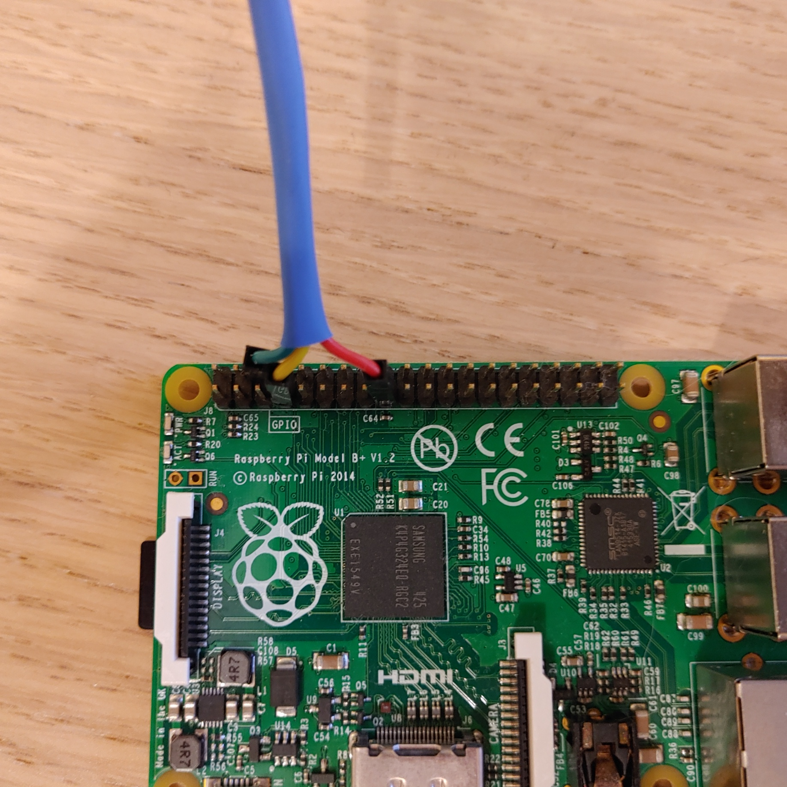
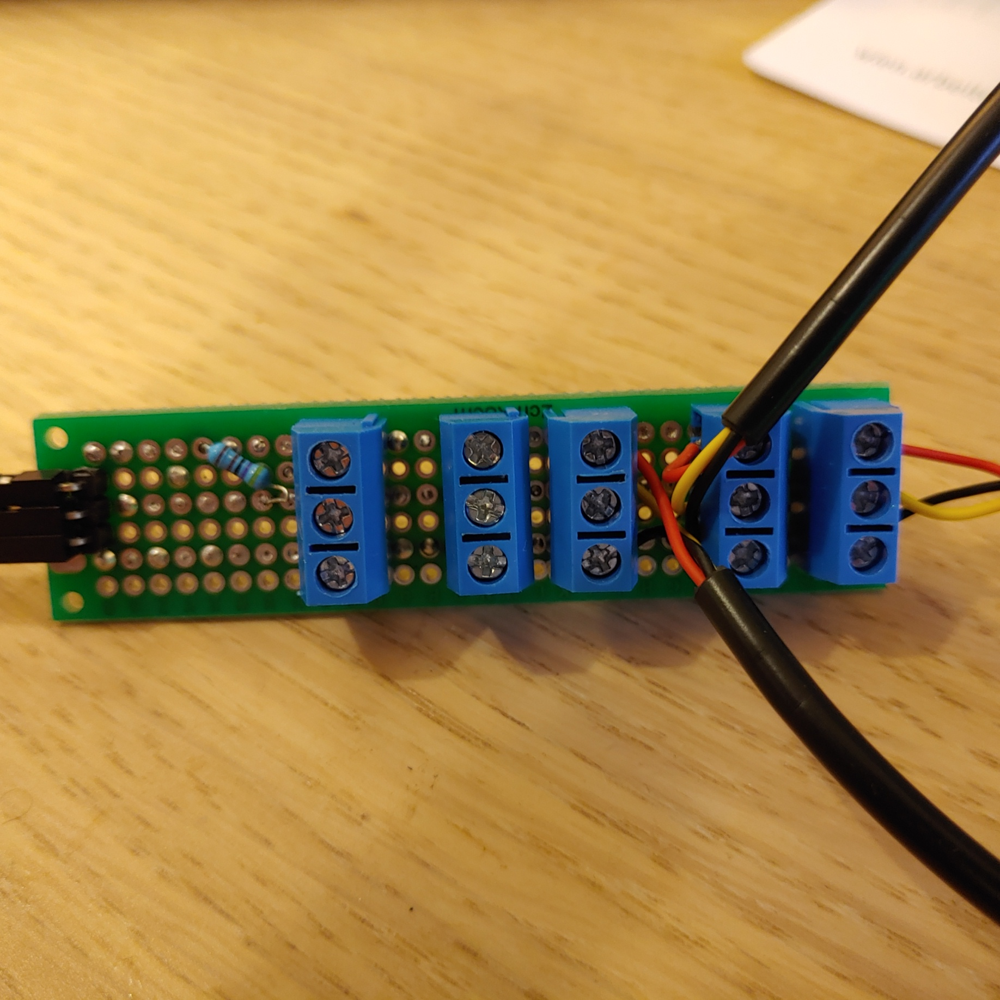
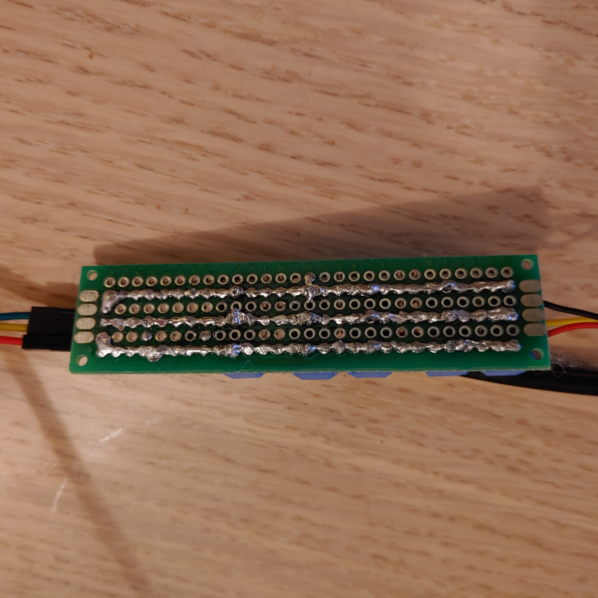

# tempsense

This project connects several DS18B20 1wire temperature
sensors to a RaspberryPi.

Following features are supported

- [x] Rotation logging (with auto-header)
  - [x] Supported formats: csv, plaintext
  - [x] Timezone support
- [x] Units supported: °C, °F
- [x] Mocking of sensors (for testing)
- [x] Map device serial numbers to custom names (device_map)
- [x] custom interval for temperature measurement
- [x] (optional) MQTT publishing for Home Assistant integration

## Prerequisites

* [DS18B20 sensors](https://www.amazon.de/AZDelivery-1M-Kabel-DS18B20-Parent/dp/B07ZQNTTX4)
> several 1wire devices can be connected to a single GPIO pin
> 
> (default: `GPIO4`, header `7`)

* RaspberryPi
* `4.7 kOhm` resistor
* solder iron, etc.

See `<projectdir>/doc/DS18B20.pdf` for assembly instructions





## Install

```commandline
pip install -r requirements.txt
```

## Usage

```
python3 -m tempsense -i=<measurement-interval-in-seconds>
```

### Mocking

To produce test output (random) start with argument `-m`.
3 fake devices with hardware names `@Mock-1`, `@Mock-2`, `@Mock-3`
will return random gauss values.
Test integration in your systems without fiddling with hardware first. ;)

### rotating file log
Use `-o=<log-file-path>` to enable rotating file logging, if this argument is omitted `stdout` is chosen as output
> Options:
> 
> `-f=(csv | plain)` choose between csv and plaintext
>
> `-rb=<backupCount>` how many log files should be kept after rotating
> 
> `-ri=<rotating-interval>` after which "time" rotating takes place
> 
> `-ru=<rotating-interval-unit>` unit of `rotating-interval`

### mqtt (home assistant)
* Install [mosquitto](https://www.home-assistant.io/docs/mqtt/broker/) Add-On in `home-assistant`
* Configure it
> Logins
> ```
> - username: <mqtt-user>
>   password: <mqtt-pw>
> ```
* Register your sensors in `configuration.yaml` of home assistant as documented in `homeassistant/configuration.yaml` (`homeassistant/configuration.mock.yaml` resp.) 
* Use it by providing at least `-mqtt=<broker-ip>`

  use `-user=<mqtt-user> -pw=<mqtt-pw>` (recommended)

> Note:
> Sensors' mqtt topics are the lower case name with ' ' replaced by '_', e.g. 'My Sensor 123' -> 'my_sensor_123'
### device mapping

Create a simple json file and map serial numbers of **your** sensors to
names of your desire
```
<<EOF > dev_map.json
{
  "28-aaaaaaaaaaaa": "Sensor-1",
  "28-bbbbbbbbbbbb": "Sensor-2",
  "28-cccccccccccc": "Sensor-3"
}
EOF
```
Use `-d=./dev_map.json` to map your devices
> MQTT topic will also be altered accordingly.
> 
> i.e. instead of
> 
> `/home-assistant/ds18b20/28-aaaaaaaaaaaa`
> 
> we publish on
> 
> `/home-assistant/ds18b20/Sensor-1`